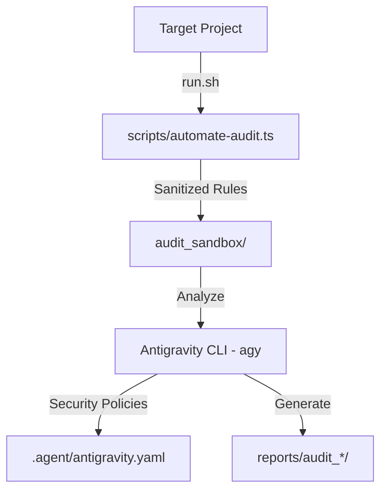

# Firebase Rules Agent (Governance Hub)

An intelligent orchestration engine designed for scale-grade security governance of Firebase security rules. Utilizing the **Antigravity CLI (agy)** as its reasoning core, this hub automates the extraction, sanitization, and security auditing of Firebase Rules (both **Cloud Firestore** and **Cloud Storage**) across target repositories.

---

## 🚀 Architecture: "Agent-as-a-Service"

The hub enforces a strict separation of concerns between the governance controller and the target projects:



*   **Brain (Governance Hub):** Contains security compliance policies ([.agent/antigravity.yaml](.agent/antigravity.yaml)) and orchestrates the AI reasoning loop.
*   **Sandbox (Clean & Copy):** Uses [scripts/automate-audit.ts](scripts/automate-audit.ts) to read, sanitize, and isolate rule files before sending them to the model, preventing leaks of sensitive comments or private paths.
*   **Reports:** Writes detailed compliance reviews and assessment files inside a timestamped folder: `reports/audit_YYYY-MM-DD_HH-MM-SS/`.

---

## ⚙️ Operation Flow

1.  **Orchestration Input:** The user runs [run.sh](run.sh) specifying either a path to a local target project, or the `--live` flag with a Firebase Project ID:
    *   **Local Project:**
        ```bash
        ./run.sh ../my-firebase-project
        ```
    *   **Live Firebase Project (downloads rules via MCP using .firebaserc):**
        ```bash
        ./run.sh ../my-firebase-project --live
        ```
2.  **Sandbox Isolation:** The sanitization script extracts rules (`firestore.rules` and `storage.rules`) from the target project, removes comments/sensitive notes, and writes them respectively as:
    *   `audit_sandbox/firestore_rules_check.txt`
    *   `audit_sandbox/storage_rules_check.txt`
3.  **Governance Reasoning:** The Antigravity agent CLI is launched with a security architect persona. It audits the rules against defined policies.
4.  **Reporting:** A markdown report is generated containing executive tables, route-level vulnerabilities, and copy-pasteable remediation code blocks.

---

## 🛠️ Security Policies

Policies are defined under [.agent/antigravity.yaml](.agent/antigravity.yaml):

```yaml
compliance:
  - id: "must-have-auth"
    rule: "request.auth != null"
    severity: "CRITICAL"
  - id: "no-public-write"
    rule: "allow write: if false"
    severity: "HIGH"
```

The AI engine uses these definitions to measure compliance, evaluate severity risks, and propose rule adjustments under the principle of **Least Privilege**.

---

## 📦 Project Structure

```text
├── .agent/
│   ├── antigravity.yaml            # Compliance policies configuration
│   └── mcp_config.json             # Firebase MCP server configuration
├── scripts/
│   └── automate-audit.ts           # Rules sanitizer and sandbox exporter
├── .gitignore                      # Workspace ignores (keeps sandboxes/reports out of git)
├── package.json                    # Project dependencies (firebase-tools, tsx, js-yaml)
├── README.md                       # Documentation
└── run.sh                          # Main orchestration script
```

---

## ⚡ Quick Start

### 1. Install Dependencies
Initialize node packages in the hub root:
```bash
npm install
```

### 2. Configure Compliance
Edit [.agent/antigravity.yaml](.agent/antigravity.yaml) to customize your corporate governance rules.

### 3. Run the Audit
Trigger the governance check locally or download them directly from the cloud:
*   **Local Audit:**
    ```bash
    ./run.sh /ruta/a/tu/proyecto-objetivo
    ```
*   **Live Cloud Audit (via MCP using .firebaserc):**
    ```bash
    ./run.sh /ruta/a/tu/proyecto-objetivo --live
    ```

### 4. Read the Results
The final results are exported directly into the `reports/` folder. Files are automatically ignored in Git to prevent polluting your codebase history.
