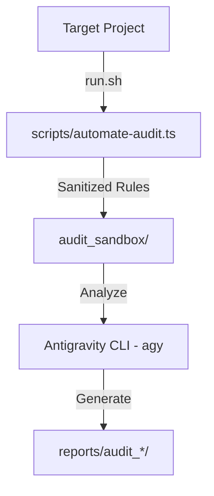

# Firebase Rules Agent

An intelligent orchestration engine designed for scale-grade security governance of Firebase security rules. Utilizing the **Antigravity CLI (agy)** as its reasoning core, this hub automates the extraction, sanitization, and security auditing of Firebase Rules (both **Cloud Firestore** and **Cloud Storage**) across target repositories.

---

## 🚀 Architecture: "Agent-as-a-Service"

The hub enforces a strict separation of concerns between the governance controller and the target projects:



*   **Sandbox (Clean & Copy):** Uses [scripts/automate-audit.ts](scripts/automate-audit.ts) to read, sanitize, and isolate rule files before sending them to the model, preventing leaks of sensitive comments or private paths.
*   **Orchestration & Reasoning:** Uses `run.sh` and the Antigravity CLI (`agy`) to run security rules audits using the AI's general reasoning loop and Firebase MCP tools.
*   **Reports:** Writes detailed compliance reviews and assessment files inside a timestamped folder: `reports/audit_YYYY-MM-DD_HH-MM-SS/`.

---

## ⚙️ Operation Flow

1.  **Orchestration Input:** The user runs [run.sh](run.sh) specifying either a path to a local target project, or the `--live` flag with a Firebase Project ID:
    *   **Local Project:**
        ```bash
        ./run.sh ../my-firebase-project
        ```
    *   **Live Firebase Project (downloads rules via MCP using .firebaserc):**
        ```bash
        ./run.sh ../my-firebase-project --live
        ```
2.  **Sandbox Isolation:** The sanitization script extracts rules (`firestore.rules` and `storage.rules`) from the target project, removes comments/sensitive notes, and writes them respectively as:
    *   `audit_sandbox/firestore_rules_check.txt`
    *   `audit_sandbox/storage_rules_check.txt`
3.  **Governance Reasoning:** The Antigravity agent CLI is launched with a security architect persona. It audits the rules using the model's expert security reasoning.
4.  **Reporting:** A markdown report is generated containing executive tables, route-level vulnerabilities, and copy-pasteable remediation code blocks.

---


## 📦 Project Structure

```text
├── .agent/
│   └── mcp_config.json             # Firebase MCP server configuration
├── scripts/
│   └── automate-audit.ts           # Rules sanitizer and sandbox exporter
├── .gitignore                      # Workspace ignores (keeps sandboxes/reports out of git)
├── package.json                    # Project dependencies (firebase-tools, tsx, js-yaml)
├── README.md                       # Documentation
└── run.sh                          # Main orchestration script
```

---

## 📋 Prerequisites

Before running the agent, make sure you have the following installed and configured:
1. **Node.js** (v16+) and **npm**.
2. **Antigravity CLI** (`agy`) installed globally and logged in.
3. **Firebase CLI** logged in (only required for `--live` cloud audits):
   ```bash
   npx firebase login
   ```

---

## ⚡ Quick Start

### 1. Install Dependencies
Initialize node packages in the hub root:
```bash
npm install
```

### 2. Run the Audit
Trigger the governance check on a local directory, or pull and audit live rules directly from the cloud:

*   **Option A: Local Audit (Static Files)**
    Reads local `firestore.rules` and `storage.rules` directly from the project directory:
    ```bash
    ./run.sh /path/to/your/firebase-project
    ```
*   **Option B: Live Cloud Audit (via MCP)**
    Extracts the active Firebase Project ID from the target project's `.firebaserc` file, uses the Firebase MCP server to download the live rules, and runs the audit:
    ```bash
    ./run.sh /path/to/your/firebase-project --live
    ```

### 3. Read the Results
Each audit run creates a dedicated, timestamped folder inside the `reports/` directory to prevent files from being overwritten:
```text
reports/
└── audit_YYYY-MM-DD_HH-MM-SS/
    ├── security_audit_report.md          # Detailed security report in Spanish
    └── security_audit_assessment.json    # JSON report containing risk score, summary, and key findings
```
*Note: The `reports/` and `audit_sandbox/` folders are ignored by git to keep your repository history clean.*

---

## 🔌 Firebase MCP Integration

The live cloud audit utilizes the **Firebase MCP server** defined in [.agent/mcp_config.json](.agent/mcp_config.json):
* When `--live` is passed, `run.sh` temporarily configures the active environment variables (`GCLOUD_PROJECT` and `FIREBASE_PROJECT`) with the Project ID found in `.firebaserc`.
* The Antigravity agent CLI calls the `firebase_get_security_rules` MCP tool to pull current live rules directly from Firebase console.
* The rules are sanitized local sandbox copies (`audit_sandbox/`), preserving data privacy by stripping sensitive local comments before LLM processing.
